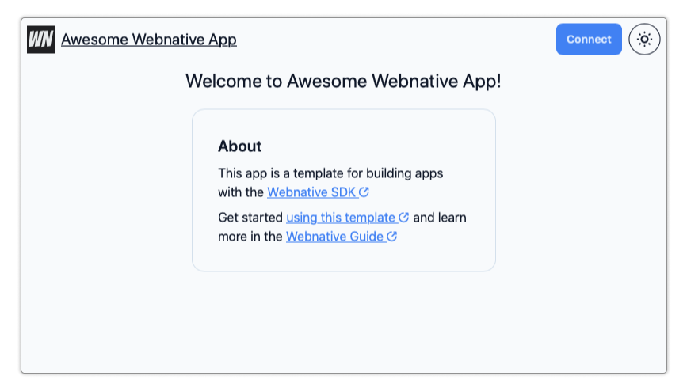
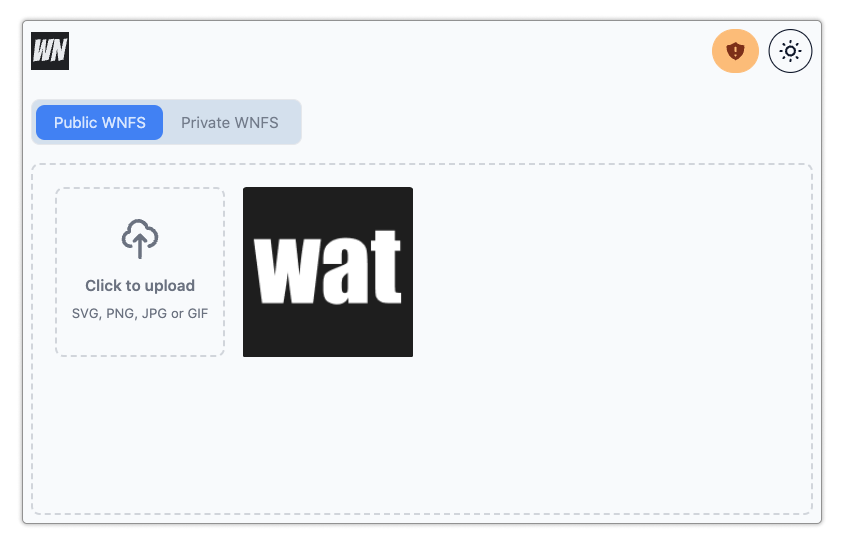

# Webnative App Template

[](https://fission.codes) [](https://github.com/fission-suite/webnative) [](https://discord.gg/zAQBDEq) [](https://talk.fission.codes) [](https://app.netlify.com/sites/webnative/deploys)



The Webnative App Template is a clone-and-go template for building a web application using Webnative, fast. Clone, customize, and deploy to have a running distributed app in mere minutes.

## 🤔 What's Webnative?

[The Webnative SDK](https://github.com/fission-codes/webnative) empowers developers to build fully distributed web applications without needing a complex back-end. The SDK provides:

-   user accounts (via [the browser's Web Crypto API](https://developer.mozilla.org/en-US/docs/Web/API/Web_Crypto_API)),
-   authorization (using [UCAN](https://ucan.xyz))
-   encrypted file storage (via the [Webnative File System](https://guide.fission.codes/developers/webnative/file-system-wnfs), backed by the [InterPlanetary File System](https://ipfs.io/), or IPFS)
-   and key management (via websockets and a two-factor auth-like flow).

Webnative applications work offline and store data encrypted for the user by leveraging the power of the web platform. You can read more about Webnative in Fission's [Webnative Guide](https://guide.fission.codes/developers/webnative).

## 📦 What does this template give me?

### 🥰 Silky-smooth end-user flows

The Webnative App Template provides a _silky-smooth user experience_ out of the box. Creating an account and linking a second device feels familiar, comfortable, and obvious. Webnative authentication is key-based rather than password-based, so we've focused heavily on the authentication flows, borrowing language and screens from two-factor auth flows.

### 🧱 Built with a modern web stack

The app template is built with modern web technologies:

-   SvelteKit (powered by Vite under the hood)
-   TypeScript
-   Tailwind
-   DaisyUI

### 👩‍🏫 A simple Webnative demo to learn from



The app template includes a functioning application: an image gallery. Check out the image gallery code to learn how a Webnative application handles things like file uploads, directories, etc.

## 🚀 Getting Started

You can try out the template yourself [here](https://webnative.netlify.app/).

Ready? Let's go:

1. Clone the repository:

    ```shell
    git clone git@github.com:fission-codes/webnative-app-template.git
    ```

2. Install the dependencies.

    ```shell
    npm install
    ```

3. Start the local development server.

    ```shell
    npm run dev
    ```

4. Navigate to `http://localhost:5173` in your web browser.

## 🛠 Customize your app

The app template is designed to be easy for you to _make it your own._ Here's how:

1. Rename your application.

    In `/src/lib/app-info.ts`:

    - Change `appName` to the name of your app.
    - Change `appDescription` to a simple, 1-sentence description of your app.
    - Once you [deploy](#deploy) your app, change `appURL` to the production URL.

    In `package.json`, change `name` to your application's name.

1. Customize your app's logo.

    - App Logo SVG can be customized in `/src/components/icons/Brand.svelte`. Target an image that is 35 pixels high.
    - Replace the favicon files in `/static` by following the instructions in [this blog post](https://evilmartians.com/chronicles/how-to-favicon-in-2021-six-files-that-fit-most-needs)
    - Generate a Twitter/Social Media Embed image.
        - In `/src/lib/app-info.ts`, change `appImageURL` to match the URL of your embed image.
        - In `/src/routes/+layout.svelte`, update `og:image:width` and `og:image:height` to the size of your embed image.

1. Customize the look and feel.

    The app template is built using [Tailwind](https://tailwindcss.com/) and [DaisyUI](https://daisyui.com/). You can customize basic theme colors by editing `/tailwind.config.css`. Check out the [DaisyUI Theme Generator](https://daisyui.com/theme-generator/) to play around with theme colors or read the [customization guide](https://daisyui.com/docs/customize/) to customize the component appearance.

1. Clear out the app's home page.

    The home page content is in `/src/routes/+page.svelte`. Delete everything in the file (but don't delete the file!) to start over with a blank home page.

1. Remove the image gallery demo app code.

    If you're not building an image gallery, you don't need the gallery demo code, except perhaps to learn from. To get rid of it, delete:

    - `/src/routes/gallery`
    - the `initializeFilesystem` function in `/src/lib/auth/account.ts` creates directories used by WNFS. Change those to what you need for your app or delete them if you're not using WNFS.

👏 You're ready to start adding custom functionality! 🚀

Check out the [Webnative Guide](https://guide.fission.codes/developers/webnative) for Webnative questions or [UCAN.xyz](https://ucan.xyz) for UCAN questions.

## 🧨 Deploy

The Webnative App Template is currently deployed as a [Netlify app](https://webnative.netlify.app) and a [Fission app](https://webnative-template.fission.app), but it should be supported on any static hosting platform (Vercel, Cloudflare Pages, etc).

### Netlify

In order to deploy your Webnative application on Netlify:

1. Create a new Netlify site and connect your app's git repository. (If you don't have your application stored in a git repository, you can upload the output of a [static build](#static-build).)
2. Netlify takes care of the rest. No Netlify-specific configuration is needed.
3. There is no step 3.

### Fission App Hosting

A Webnative application can be published to IPFS with the [Fission CLI](https://guide.fission.codes/developers/cli) or the [Fission GitHub publish action](https://github.com/fission-suite/publish-action).

To publish with the Fission CLI:

1. [Install the CLI](https://guide.fission.codes/developers/installation)
2. Run `fission setup` to make a Fission account
3. Run `npm run build` to build the app
4. Delete `fission.yaml`
5. Run `fission app register` to register a new Fission app (accept the `./build` directory suggestion for your build directory)
6. Run `fission app publish` to publish your app to the web

Your app will be available online at the domain assigned by the register command.

To set up the GitHub publish action:

1. Register the app with the CLI
2. Export your machine key with `base64 ~/.config/fission/key/machine_id.ed25519`
3. Add your machine key as a GH Repository secret named `FISSION_MACHINE_KEY`
4. Update the `publish.yml` with the name of your registered app

See the [Fission Guide](https://guide.fission.codes/developers/installation) and the publish action README for more details.

### Static Build

Export a static build.

```shell
npm run build
```

The build outputs the static site to the `build` directory.
